# Electron-Angular

本專案為 Angular 為底進行開發，並整合 Electron 輸出成可跨平台的桌面應用程式。

## 何謂 Electron ?

Electron 是一個使用 JavaScript、HTML 和 CSS 建構桌面應用程式的框架。

內建 Chromium 和 Node.js，達到 Windows、macOS 和 Linux 跨平台應用，不需要本地開發經驗。

## 各平台開發比較

|   平台   |   Electron    | WinForm |     WPF      | Tkinter |
| :------: | :-----------: | :-----: | :----------: | :-----: |
|  跨平台  |       V       |    X    |      X       |    V    |
|   美觀   |       V       |    X    |      X       |    V    |
| 開發語言 | HTML、CSS、JS | VB、C#  | XML、C#、CSS | Python  |

## 操作步驟

### 建置 Angular 環境

1. 建置新專案

2. 執行 `npm start` 並瀏覽 `http://localhost:2000/` 確認是否正常
   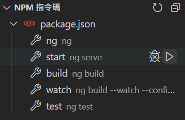
   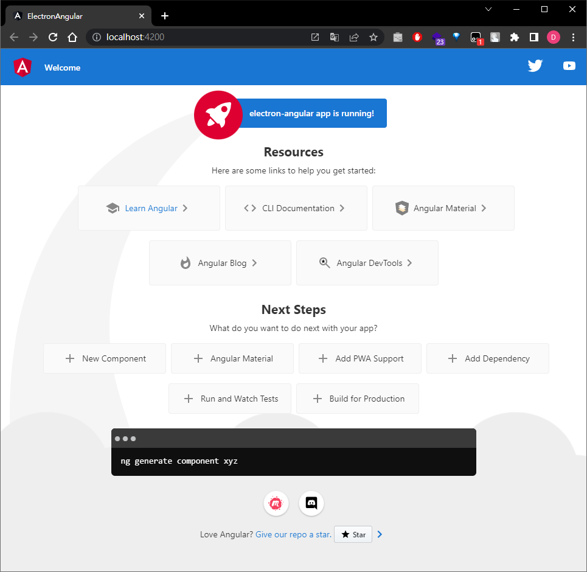

3. 執行 `npm build` 產生 **dist/Electron-Angular/**

   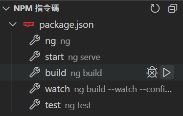

   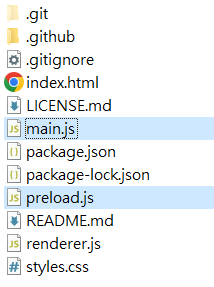

### 安裝設定 electron

1. install electron

   ```cmd
   npm install --save-dev electron
   ```

2. git clone `electron/electron-quick-start` 專案

   ```cmd
   git clone https://github.com/electron/electron-packager.git
   ```

3. 將 `electron-quick-start` 內的 **main.js** 及 **preload.js** 複製到專案根目錄

   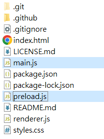

   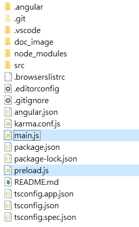

4. 修改 `main.js` 相關設定

   - 執行主程式路徑

     ```js
     // and load the index.html of the app.
     // mainWindow.loadFile('index.html');
     mainWindow.loadFile("dist/electron-angular/index.html");
     ```

   - 額外補充：

     - 設定視窗大小

        ```js
        // Create the browser window.
        const mainWindow = new BrowserWindow({
          width: 800,
          height: 600,
          webPreferences: {
            preload: path.join(__dirname, "preload.js"),
          },
        });
        ```

     - 若需要 debug 可將以下程式碼片段打開

        ```js
        // Open the DevTools.
        mainWindow.webContents.openDevTools();
        ```

        或在應用程式執行時使用 `Ctrl + Shift + i` 開啟關閉

        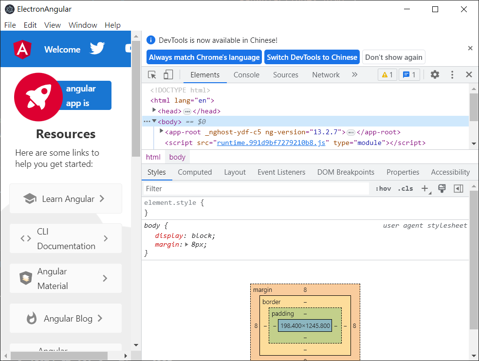

5. 修改 `index.html` 中 base tag 的 **href** attribute

   ```html
   <!--<base href="/" />-->
   <base href="./" />
   ```

6. 在 `package.json` 中增加 `"main": main.js"` ，並在 **scripts** 處中增加 `electron` 指令。

   ```js
   ...,
   "main" : "main.js",
   ...,
   "scripts": {
     ...,
     "electron": "ng build && electron ."
   },
   ...
   ```

7. 執行 `npm electron` 驗證

   ```cmd
    npm electron
   ```

   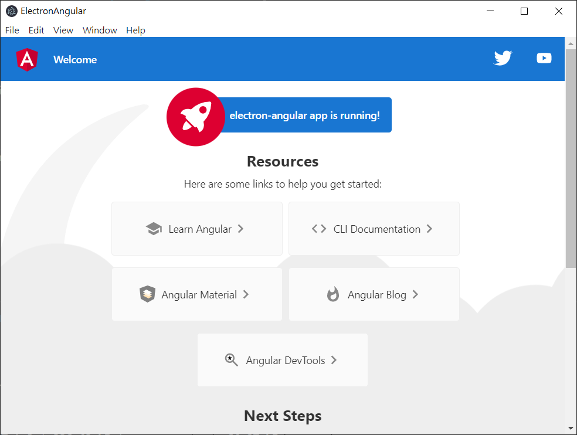

### 安裝 electron-packager 輸出各平台程式

1. install `electron-packager`

   ```cmd
   npm install -d electron-packager
   ```

2. electron-packager 的語法如下：

   ```cmd
   electron-packager <sourcedir> <appname> --platform=<platform> --arch=<arch> [optional flags...]
   ```

   - sourcedir：表示來源資料夾，. 表示當前來源為資料夾。
   - appname：輸出的執行檔名稱。
   - --platform：表示要建置的平台，目前有：linux、win32、darwin,、mas、all。
   - --arch：表示目前系統架構，選項有：ia32、x64、armv7l、arm64、all。
   - --overwrite：若輸出資料夾已存在，加此參數覆寫。
   - --asar：針對原始 Web 程式( resources 資料夾)可進行封裝

   其他參數可參考 [官方文件](https://github.com/electron/electron-packager)。

3. Window 64 位元版本

   - 在 `package.json` 的 **scripts** 插入下列指令：

     ```js
     ...,
     "scripts": {
       ...,
       "build_win": "electron-packager . WinApp --platform=win32 --arch=x64 --overwrite",
       ...
     },
     ...
     ```

   - 執行 `npm run build_win` 建置，輸出 `WinApp-win32-x64` Folder。

     ```cmd
     npm run build_win
     ```

     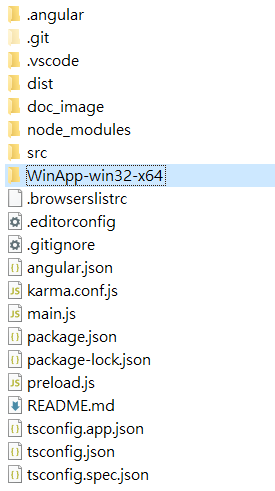

   - 執行資料夾內 `WinApp.exe`

     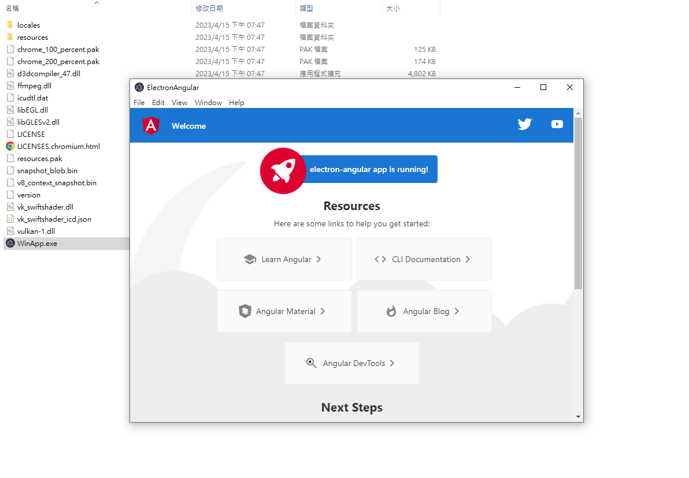

4. Linux 64 位元版本

   - 在 `package.json` 的 **scripts** 插入下列指令：

     ```js
     ...,
     "scripts": {
       ...,
       "build_linux": "electron-packager . LinuxApp --platform=linux --arch=x64 --overwrite",
       ...
     },
     ...
     ```

   - 執行 `npm run build_linux` 建置，輸出 `LinuxApp-linux-x64` Folder。

     ```cmd
     npm run build_linux
     ```

     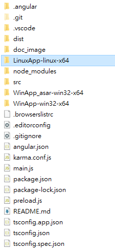

   - 執行資料夾內 `LinuxApp`

     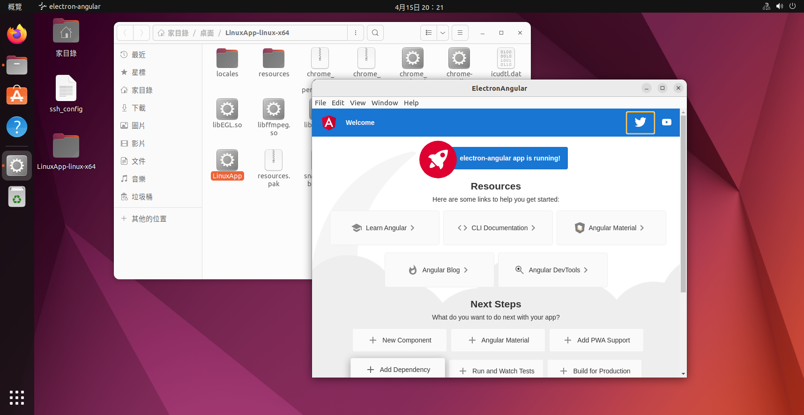

5. 補充說明
   - --asar 參數
     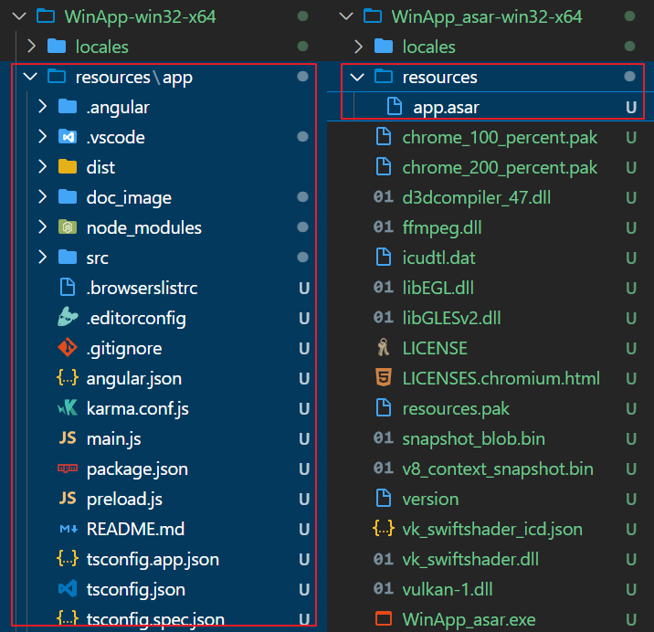

## 參考資源

- [Electron 和當下其他的桌面開發方法相比如何？](https://read01.com/zh-tw/KDJ23nM.html#.ZDFgYHZBzmE)
- [Angular for Desktop Applications with Electron](https://www.logicflow.ai/blog/angular-desktop-applications-with-electron)
- [Electron：跨平台的視窗應用程式](https://jonny-huang.github.io/angular/training/18_electron/)
